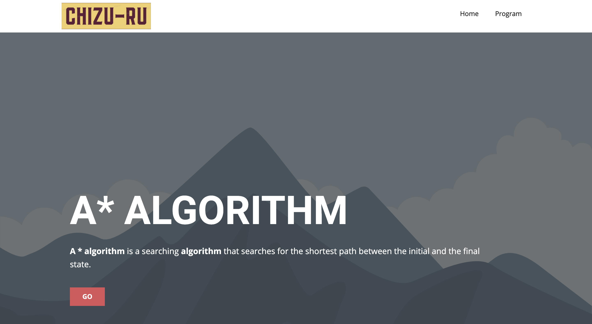

# 地図―る (Chizu-ru)
Aplikasi untuk menentukan jarak dua tempat dengan menggunakan algoritma A*

## Table of contents
* [Screenshots](#screenshots)
* [Technologies](#technologies)
* [Setup](#setup)
* [Features](#features)
* [Status](#status)
* [Inspiration](#inspiration)
* [Contact](#contact)

## Screenshots



## How to use
1. run this command `git clone https://github.com/jspmarc/chizu-ru.git`
2. Jalankan `bin/chizu-ru`
> pastikan binary file chizu-ru berada di folder yang sama dengan folder views/
3. Buka `http://localhost:8080` di peramban, lalu buka menu Program
4. Tambahkan file graf
5. Tekan dua sudut peta yang ingin dihitung jaraknya
6. Tekan tombol 'get distance'

## Format file
baris pertama adalah banyak sudut, misalnya N sudut\
baris kedua sampai N + 1 akan berisi informasi sudut
(`<nama>,<latitude>,<longitude>`)\
baris N + 2 sampai akhir akan berisi matriks berukuran N x N yang berisi
matriks ketetanggaan antarsudut

Contoh:
```
2
Bucharest,44.457,26.093
Arad,46.181,21.312
0 1
1 0
```
Contoh lain dapat dilihat pada folder `test/`


## Status
Project is: _finished_

## Authors
Joel Triwira - 13519073\
Josep Marcello - 13519164